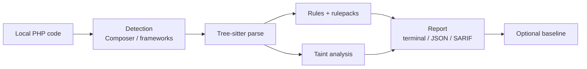

# Fermio Sec CLI

> **Local-first. Never execute the application.**
> Static analysis for PHP and its main ecosystems — deterministic reports for terminal, JSON and SARIF.

`fermio-sec` scans source locally: it detects the project, parses with Tree-sitter, applies rules and taint analysis, and emits findings with stable fingerprints. Application code, Composer scripts and bootstraps are **never executed**.



| Layer | What | Result |
|---|---|---|
| **Detection** | Composer, Laravel, Symfony, WordPress | project profile |
| **Parse** | Tree-sitter PHP | IR + syntax diagnostics |
| **Rules** | built-ins + declarative rulepacks | deterministic findings |
| **Taint** | command / SQL / reflected XSS | source→sink flows |
| **Output** | terminal, JSON, SARIF 2.1.0 | SHA-256 fingerprints |

## Start here

<div class="grid cards" markdown>

- :material-rocket-launch: **[Getting started](getting-started.md)** — install the binary and run the first `scan`.
- :material-magnify-scan: **[Scanning](scanning.md)** — formats, limits, ignores and fail-on severity.
- :material-cog: **[Configuration](configuration.md)** — the full `.fermio.toml`.
- :material-shield-lock: **[Rulepacks](rulepacks.md)** — local declarative rules, no scripts.
- :material-console: **[CLI reference](cli-reference.md)** — every command and flag.
- :material-lock: **[Security model](security-model.md)** — what the CLI never does.

</div>

## Quick install

=== "Release"

    ```bash
    sha256sum -c fermio-sec-*.tar.gz.sha256
    tar -xzf fermio-sec-*.tar.gz
    sudo install -m 0755 fermio-sec-*/fermio-sec /usr/local/bin/fermio-sec
    fermio-sec --version
    ```

=== "Source"

    ```bash
    cargo build --locked --release -p fermio-cli
    ./target/release/fermio-sec --version
    ```

## What's new

- **v0.1.0-rc.1** — first release candidate: local-first PHP, Laravel/Symfony/WordPress, command/SQL/XSS taint, declarative rulepacks, baselines and multi-platform archives with SHA-256.
- License **AGPL-3.0-only**.

Details in the [CHANGELOG](https://github.com/fermio-technologies/fermio-sec-cli/blob/main/CHANGELOG.md).
