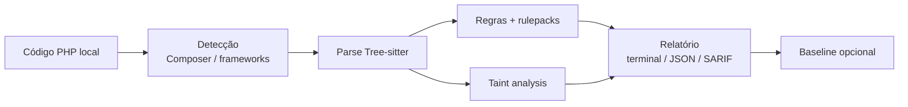

# Fermio Sec CLI

> **Local-first. Sem executar a aplicação.**
> Análise estática para PHP e seus ecossistemas principais — com relatórios determinísticos para terminal, JSON e SARIF.

O `fermio-sec` varre o código-fonte localmente: detecta o projeto, faz parse com Tree-sitter, aplica regras e análises de taint, e emite findings com fingerprints estáveis. O código da aplicação, scripts Composer e bootstraps **nunca são executados**.



| Camada | O quê | Resultado |
|---|---|---|
| **Detecção** | Composer, Laravel, Symfony, WordPress | perfil do projeto |
| **Parse** | Tree-sitter PHP | IR + diagnósticos de sintaxe |
| **Regras** | built-ins + rulepacks declarativos | findings determinísticos |
| **Taint** | command / SQL / XSS refletido | fluxos source→sink |
| **Saída** | terminal, JSON, SARIF 2.1.0 | fingerprints SHA-256 |

## Comece por aqui

<div class="grid cards" markdown>

- :material-rocket-launch: **[Começando](getting-started.md)** — instale o binário e rode o primeiro `scan`.
- :material-magnify-scan: **[Escaneando](scanning.md)** — formatos, limites, ignores e falha por severidade.
- :material-cog: **[Configuração](configuration.md)** — o `.fermio.toml` completo.
- :material-shield-lock: **[Rulepacks](rulepacks.md)** — regras declarativas locais, sem scripts.
- :material-console: **[Referência CLI](cli-reference.md)** — todos os comandos e flags.
- :material-lock: **[Modelo de segurança](security-model.md)** — o que a CLI nunca faz.

</div>

## Instalação rápida

=== "curl | sh"

    ```bash
    curl -fsSL https://raw.githubusercontent.com/fermio-technologies/fermio-sec-cli/main/scripts/install.sh | sh
    ```

=== "Release manual"

    ```bash
    # Baixe o archive do GitHub Releases, verifique o checksum e instale:
    sha256sum -c fermio-sec-*.tar.gz.sha256
    tar -xzf fermio-sec-*.tar.gz
    sudo install -m 0755 fermio-sec-*/fermio-sec /usr/local/bin/fermio-sec
    fermio-sec --version
    ```

=== "Source"

    ```bash
    cargo build --locked --release -p fermio-cli
    ./target/release/fermio-sec --version
    ```

## O que há de novo

- **v0.1.0-rc.1** — primeiro release candidate: PHP local-first, Laravel/Symfony/WordPress, taint command/SQL/XSS, rulepacks declarativos, baselines e archives multiplataforma com SHA-256.
- Licença **AGPL-3.0-only**.

Detalhes no [CHANGELOG](https://github.com/fermio-technologies/fermio-sec-cli/blob/main/CHANGELOG.md).
